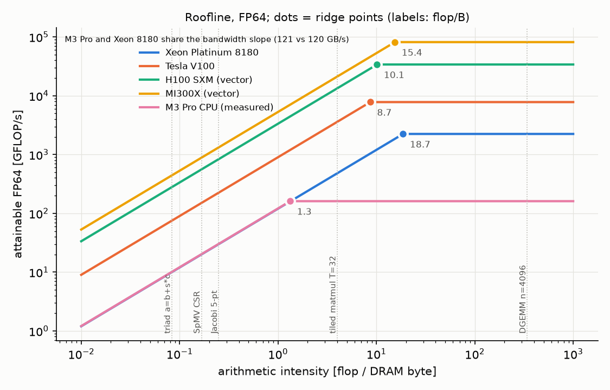

# 03 Performance modelling

TISS topic 3 [S2]. A performance model predicts $T$ from a handful of machine
numbers (note 02) and a count of the kernel's work and traffic. Rupp's rule:
"profile and model before you optimize" [S4 `content.tex`]; his tutorial
teaches modelling "by example" (vector add, CG, sparse transpose) [S4
`modeling-examples.tex`], reproduced below with numbers. Code:
`src/py/roofline.py`, `src/py/perf_models.py`, `src/cpp/stream_triad.cpp`.

## 1. Roofline [S11]

$$P(I) = \min\bigl(P_\text{peak},\; I\cdot B\bigr),\qquad I^* = P_\text{peak}/B .$$

- $I$ is flops per byte of **DRAM** traffic [S11]; cache traffic belongs to a separate, higher roof.
- **Ceilings** below the roofs name missing optimisations: no SIMD/FMA lowers the compute roof; no unit stride or no prefetch lowers the bandwidth roof [S11].
- Reading it: a measured point far below the roof at its $I$ means the kernel is limited by something the model omits (latency, divergence, gather).

`python src/py/roofline.py --png notes/img/roofline.png` (Xeon and V100 parsed
from Rupp's vendored data [S5], H100 [S29], MI300X [S30], this Mac measured
[S32]):

| kernel | $I$ | Xeon 8180 | V100 | H100 | MI300X | M3 Pro CPU |
|---|---|---|---|---|---|---|
| triad | 0.083 | 10.0 | 75 | 279 | 442 | 10.1 |
| SpMV CSR | 0.167 | 20.0 | 150 | 558 | 883 | 20.2 |
| Jacobi 5-pt | 0.25 | 30.0 | 225 | 838 | 1 325 | 30.2 |
| tiled matmul $T=32$ | 4.0 | 480 | 3 600 | 13 400 | 21 200 | 161 |
| DGEMM $n = 4096$ | 341 | 2 240 | 7 800 | 34 000 | 81 700 | 161 |

(attainable GFLOP/s; the Mac column uses `roofline.py`'s defaults, the measured 121 GB/s triad and 161 GFLOP/s tiled matmul of 2026-09-28.) The Mac's bandwidth slope coincides with the 2017 Xeon socket's (121 vs 120 GB/s): a laptop SoC now has a server socket's memory bandwidth of eight years ago, at 7 % of its FP64 peak (as far as we can measure it).

## 2. Latency-bandwidth (alpha-beta) model [S14]

$$T(n) = \alpha + \frac{n}{\beta},\qquad n_{1/2} = \alpha\beta,\qquad \frac{n}{T(n)}\Big|_{n=n_{1/2}} = \frac{\beta}{2}.$$

$\alpha$: fixed cost per operation (message, kernel launch, parallel region);
$\beta$: asymptotic bandwidth; $n_{1/2}$ (Hockney's half-performance length):
the size below which you get less than half of $\beta$. Rupp's vector-add model
is this form, $T_2(N) \approx 3\cdot 8 N/B + \text{latency}$ [S4].

| channel | $\alpha$ | $\beta$ | $n_{1/2}$ | source |
|---|---|---|---|---|
| PCIe 3 x16 | 10 us | 16 GB/s | 160 KB | [S4] |
| V100 kernel | 10 us | 900 GB/s | 9.0 MB | [S4] [S5] |
| H100 kernel | 10 us (assumed as for V100) | 3 350 GB/s | 33.5 MB | [S4] [S29] |
| **this Mac**, OpenMP `x = y + z`, passive wait (default) | 19.2 us | 119 GB/s | 2.3 MB | [S32] |
| this Mac, `OMP_WAIT_POLICY=active` | 1.37 us | 94 GB/s (under load) | 129 KB | [S32] |

Measured table (`stream_triad --bench`, 12 threads, default policy):

| $N$ | 1 024 | 16 384 | 262 144 | 1 048 576 | 4 194 304 | 33 554 432 |
|---|---|---|---|---|---|---|
| $T$ [us] | 19.2 | 18.0 | 28.5 | 140.6 | 856 | 6 752 |
| GB/s | 1.3 | 21.8 | 221 | 179 | 118 | 119 |

The first three columns are flat: pure $\alpha$. The 262 144 column exceeds
DRAM bandwidth because 6.3 MB of traffic fits the 16 MB L2. Consequence for a
GPU: a vector of $10^5$ doubles (2.4 MB of traffic) on an H100 moves at
$2.4/(10 + 0.7)$ MB/us $= 224$ GB/s, 7 % of $\beta$. **Fuse kernels** and
**keep data resident**; batch small problems.

## 3. Little's law [S12]

$L = \lambda W$: items in the system = arrival rate x time in system. For memory:
$$\text{bytes in flight} = \text{latency} \times \text{bandwidth}.$$

- This Mac: $100\,\text{ns} \times 120\,\text{GB/s} = 12$ KB $= 94$ lines of 128 B outstanding, chip-wide (`perf_models.py`).
- H100: $600\,\text{ns}$ *(unsourced, order of magnitude)* $\times 3.35$ TB/s $= 2.0$ MB $= 251\,000$ doubles in flight. With one outstanding 8-byte load per thread that is a quarter of a million threads, which is the origin of "at least 10 000 logical threads" [S4 `cuda.tex`] and of occupancy (note 04). Volkov's alternative: fewer threads, several independent loads each (ILP) [S38].

## 4. Worked model: CG on a GPU (Rupp's example) [S4]

Per CG iteration for a 2-D 5-point Laplacian: 6 kernel launches plus 2 for
reductions (8 us), two device-to-host reads of dot products (2 x 2 us), and 20
vector-length accesses (SpMV as 7, then 2 + 3 + 3 + 2 + 3):
$$T(N) = 8\cdot10^{-6} + 2\cdot 2\cdot10^{-6} + 20\cdot 8N/B .$$
Latency and bandwidth terms are equal at $N^* = 12\,\text{us}\cdot B/160$:
$N^* = 67\,500$ on a V100, $251\,000$ on an H100.

| $N$ | V100 [us] | H100 [us] | this Mac, active, $8\alpha$ = 11 us | this Mac, passive, $8\alpha$ = 152 us |
|---|---|---|---|---|
| $10^3$ | 12.2 | 12.0 | 12.5 | 153 |
| $10^4$ | 13.8 | 12.5 | 24.4 | 165 |
| $10^5$ | 29.8 | 16.8 | 143 | 284 |
| $10^6$ | 190 | 59.8 | 1 334 | 1 474 |
| $10^7$ | 1 790 | 490 | 13 234 | 13 375 |

(Mac rows: same 20 accesses at 121 GB/s plus 8 parallel regions of the measured
$\alpha$. They ignore that small $N$ is cache-resident, so they are pessimistic
there.) Reading: below $\sim10^4$ unknowns nothing beats the latency floor and a
CPU with a cheap runtime is as good; above $N^*$ the ratio approaches the
bandwidth ratio (H100/Mac 27x). Rupp's optimisations follow from the formula:
remove reads (fuse AXPYs into SpMV), remove synchronisations (pipelined CG
merges the two reductions into one) [S4].

## 5. Worked model: SpMV formats, and a model that fails

Model: $T = Q/B$ with $Q$ the format's stored bytes (`spmv_csr_ell --bench`,
$B = 121.4$ GB/s):

| matrix, format | $Q$ [MB] | model [ms] | measured [ms] | measured / model |
|---|---|---|---|---|
| Laplace $2048^2$, CSR | 335 | 2.76 | 3.27 | 1.18 |
| Laplace, SELL-8-256 | 335 | 2.76 | 3.16 | 1.15 |
| irregular $2^{19}$ rows, CSR ($\beta = 1$) | 174 | 1.43 | 2.86 | 2.0 |
| irregular, SELL-8-256 ($\beta = 0.937$) | 185 | 1.52 | 2.20 | 1.4 |
| irregular, ELL ($\beta = 0.205$) | 807 | 6.65 | 83.6 | **12.6** |

ELL fails the model by 12x on the CPU (17x in the final run, 112 ms). Its column-major layout
`val[k*n + i]` is designed for SIMT: thread $i$ and thread $i+1$ read adjacent
words (coalesced, note 04). A CPU thread instead walks $k$ for a fixed $i$ with
a stride of $n \cdot 8$ B = 4 MB: every access a new line and a new page. Same
bytes, different access order; the roofline cannot see it. SELL-C-$\sigma$
[S20] keeps $C = 8$ rows contiguous, which serves both SIMD lanes and warps.

## 6. Other models from the tutorial [S4]

- Sparse transpose: read and write each non-zero once, $T = 2\,(4+8)\,\text{nnz}/B$.
- Vector add: $T = 3\cdot 8N/B + \text{latency}$ (section 2).
- Load imbalance: $T = \max_i T_i$; "focus on making the slowest thread fast" [S4 `bottlenecks.tex`].

## Pitfalls

- Roofline with cache bytes instead of DRAM bytes, or with requested instead of moved bytes (write-allocate; note 02).
- Using a vendor peak as the roof instead of a measured STREAM or DGEMM number.
- Forgetting $\alpha$: the roofline has no latency term, the alpha-beta model has no FLOP term; small kernels need the second.
- Taking a model that matches on one layout as valid for all (ELL above).

## Oral-exam questions

1. **Draw the roofline of a V100 and place the dot product and a DGEMM.** Ridge at $7800/900 = 8.7$; dot at 0.125, $\le 113$ GFLOP/s; DGEMM far right, 7.8 TFLOP/s roof.
2. **What is $n_{1/2}$, and what is it for a kernel launch of 10 us on a 900 GB/s GPU?** $\alpha\beta = 9$ MB of traffic; below that the GPU delivers less than half its bandwidth.
3. **State Little's law and use it to explain why GPUs need so many threads.** Bytes in flight = latency x bandwidth; MB of outstanding loads need $10^5$ outstanding requests; each thread has few, so many threads (or ILP) [S38].
4. **Model one CG iteration on a GPU. Where is the crossover to bandwidth-bound?** Rupp's formula above; $N^* = 12\,\text{us}\cdot B/160 \approx 7\cdot10^4$ on a V100.
5. **Your measured SpMV is 12x slower than the bandwidth model. Candidates?** Access order (strided or gather, TLB), load imbalance, too few requests in flight; check format and loop order first.

Code: `src/py/roofline.py` (`Machine`, `KERNELS`, `plot`), `src/py/perf_models.py` (`alpha_beta_time`, `n_half`, `little_bytes_in_flight`), `src/cpp/stream_triad.cpp` (`size_sweep`), `src/cpp/spmv_csr_ell.cpp` (`report`). Sources: [S4] [S5] [S11] [S12] [S14] [S20] [S29] [S30] [S32] [S38].
